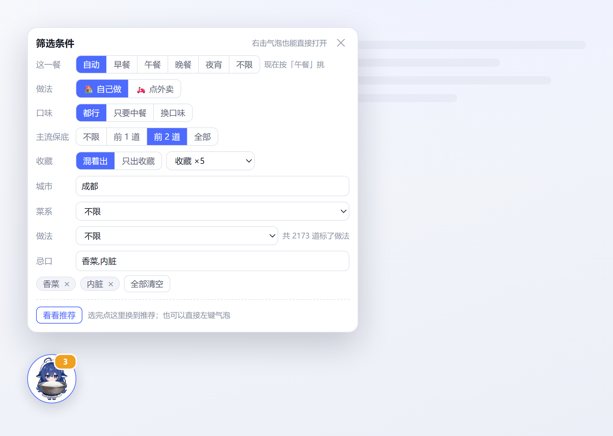
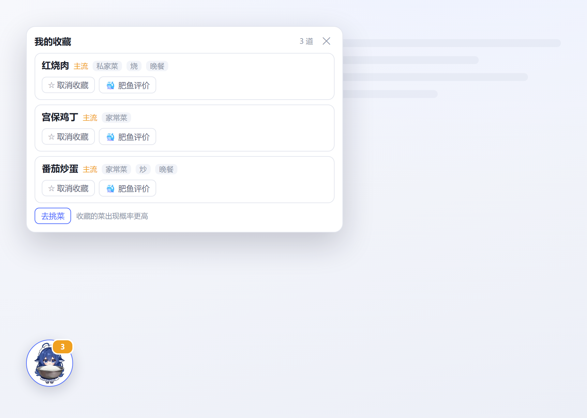

# dsh-meal-picker 今天吃什么

DeepSeek Harness 插件。右下角一个可拖动的悬浮气泡，点一下从本地菜库里挑三道菜给你；要做法、要热量估算、想听点评，都有按钮。挑菜过程完全在本地完成，不花 token。


## 特性

- **点一下 0 token**：挑菜全在本地按权重随机完成，不调用模型
- **本地菜库 4,423 道**：菜名、菜系、做法、餐次、是否适合外卖，离线可用
- **一次三道**：前两道必定是你熟悉的国民菜，第三道随机给你尝鲜
- **按时间推荐**：自动判断早餐 / 午餐 / 晚餐 / 夜宵，也能手动指定
- **两个面板**：左键气泡是推荐，右键（或顶部的黑框按钮）是筛选条件，互不干扰
- **收藏**：点星标收藏，收藏的菜出现概率明显提高；有单独的面板可以查看和取消
- **忌口永久保留**：填一次写进本地文件，重启仍在；列成小标签，每条都能单独删
- **AI 三件套**：写做法、估热量、**大肥鱼评价**（一只可爱贪吃又乖巧的鲸鱼小姑娘的点评）
- **零运行时依赖**：纯 ESM，不需要构建步骤

| 筛选条件 | 收藏与忌口 | 大肥鱼评价 |
|---|---|---|
|  |  |  |

## 目录结构

| 目录 | 作用 |
|---|---|
| `lib/` | 插件本体：算法、接口、界面 |
| `data/` | 菜库、主流菜表、数据格式示例 |
| `assets/` | 气泡图标与 README 截图 |
| `tools/` | 数据生成、抠图、截图脚本 |
| `test/` | 核心逻辑 / 宿主接口 / 客户端测试 |

根目录另有 `cordis.patch.yml`（挂载补丁）、`install.ps1` / `uninstall.ps1`（Windows 安装与卸载）、`screenshots.json`（插件市场截图声明）。

## 安装

插件通过 DSH profile 的依赖 + bundle 机制加载，装完重启 DSH 生效。

```sh
# 从仓库安装
dsh plugin --profile web add github:wcytjy/dsh-meal-picker
```

本地开发时直接用目录：

```sh
dsh plugin --profile web add file:./local/dsh-meal-picker
```

Windows 上也可以用仓库里的脚本（会先把 profile 里的 `package.json` 与 `cordis.patch.yml` 备份到 `backup-<时间戳>\`）：

```powershell
.\install.ps1 -DryRun   # 预演，不写任何文件
.\install.ps1
```

卸载用 `.\uninstall.ps1`，或 `dsh plugin --profile web remove dsh-meal-picker`。

插件的 `package.json` 声明了 `dsh.bundle.patch`，所以只要它出现在 profile 的 `dsh.profile.bundles` 里，随包携带的 `cordis.patch.yml` 就会把它挂进 loader，不必手工改 profile 的补丁文件。

## 使用

| 操作 | 结果 |
|---|---|
| 左键点气泡 | 打开推荐面板；再点一次关掉 |
| 右键点气泡 | 直接打开筛选条件面板 |
| 拖动气泡 | 换位置，位置记在浏览器本地；面板会跟着一起走 |
| 点菜名左边的 ☆ | 收藏 / 取消收藏 |
| 点「筛选条件」（黑框） | 从推荐面板切到筛选面板 |

推荐面板里每道菜给这几个按钮：

| 按钮 | 作用 | 花 token |
|---|---|---|
| 🐳 大肥鱼评价 | 让模型以大肥鱼的口吻点评这道菜 | 是（约 60 字） |
| 多来点〈菜系〉 | 把菜系切到这道菜的菜系并重新挑 | 否 |
| AI 写做法 | 让模型写出家常做法 | 是 |
| AI 估热量 | 让模型估算热量（明确标注为估算值） | 是 |
| 搜食谱 | 打开下厨房搜索页 | 否 |

只有「换一批」和上面三个 AI 按钮会产生费用，挑菜本身不花。

## 配置

写在 profile 的 `cordis.patch.yml` 里（`install.ps1` 会写一份带注释的进去），全部可选：

```yaml
- id: meal-picker
  config:
    city: 成都
    scene: takeout
    avoid: '香菜,苦瓜'
    count: 3
    bubbleSize: 96
```

| 字段 | 默认 | 说明 |
|---|---|---|
| `city` | `''` | 常住城市，命中当地菜系时加权（支持 40+ 城市） |
| `scene` | `cook` | `cook` 自己做 / `takeout` 点外卖 |
| `foreign` | `any` | `any` 都行 / `off` 只要中餐 / `only` 换口味 |
| `avoid` | `''` | 长期忌口，逗号分隔。面板里填过就以面板为准 |
| `meal` | `auto` | `auto` 按时间判断，也可固定 `breakfast`/`lunch`/`dinner`/`lateNight`，`any` 不按餐次 |
| `method` | `''` | 默认做法（炒 / 蒸 / 煮 …），留空不限 |
| `count` | `3` | 一次给几道（1~12） |
| `mainstreamCount` | `2` | 前几道必定是主流菜（0~20） |
| `recentLimit` | `12` | 记住最近推过的多少道，避免连着重复；0 = 不去重 |
| `favBoost` | `5` | 收藏菜相对每道主流菜的出现倍数（1~50） |
| `bubbleSize` | `72` | 气泡直径，像素（40~140） |

超出范围的取值会被夹到边界，不会导致插件加载失败。

## 选菜规则

一次三道，**前两道必定主流、第三道按权重随机**。

菜库里标了 132 道常见菜（红烧肉、番茄炒蛋、宫保鸡丁这类）为「主流」（`star: 5`）。前两道只从这 132 道里挑；第三道走正常的加权随机 —— 主流菜权重 120、其余 1~6，所以第三道多数时候仍是主流菜，偶尔给一道没吃过的。实测一万批：前两道 100% 是主流菜，第三道约 58%。

保底道数由 `mainstreamCount` 控制：设 0 等于不保底，设成和 `count` 一样则整批都是主流菜。池子里一道主流菜都没有时（例如筛了个只有冷门菜的菜系）自动退回整池，不会返回空列表。

### 餐次

按**使用者的本地钟点**判断（客户端把小时发给宿主，不用宿主时钟）：

| 时段 | 餐次 |
|---|---|
| 05:00–10:00 | 早餐 |
| 10:00–15:00 | 午餐 |
| 15:00–21:00 | 晚餐 |
| 其余 | 夜宵 |

餐次是软偏好：命中加权、明确不对餐降权、没标餐次的轻微降权（不确定不等于不合适，所以不排除）。菜名与做法能推出餐次的菜共 2,344 道（53%）。实测命中对应餐次的比例：早餐 42.7%、午餐 55.4%、晚餐 78.3%、夜宵 40.2%。

### 权重

单道菜的最终权重由这些因素相乘：菜系是否为常住城市（×2.5）、做法是否适合自己做或点外卖（×2）、餐次是否合适、是否收藏（基准权重抬到 120 再乘 `favBoost`）、最近是否推过（越近降得越狠，最低降到 5%）。权重只在候选池内部比较，不影响硬筛选。

## 数据

`data/dishes.json` 是单行压缩 JSON，4,423 条，每条只有这些字段：

| 字段 | 说明 |
|---|---|
| `name` | 菜名 |
| `cuisine` | 菜系（38 个取值） |
| `foreign` | 是否外国菜 |
| `scene` | `home` 适合自己做 / `takeout` 偏外卖 / `both` 都行 |
| `star` | `5` = 主流菜，`0` = 普通菜 |
| `weight` | 基础权重，主流菜 120，其余 1~6 |
| `methods` | 做法标签（炒 / 蒸 / 煮 / 炖 / 焖 / 烧 / 炸 / 煎 / 烤 / 卤 / 拌 / 汤 / 腌），2,168 道有标签 |
| `meals` | 餐次标签（breakfast / lunch / dinner / lateNight），2,344 道有标签 |

菜名与菜系来自公开的食物数据快照；场景、主流标记、权重、做法与餐次标签由菜名和菜系规则生成，脚本都在 `tools/` 下，可复核、可重复运行。

**这个插件不存热量与营养素数据。** 需要热量时由「AI 估热量」现算，并明确标注为估算值。

## 工具

```sh
python tools/tag_methods.py        # 按菜名标做法（多标签）
python tools/tag_meals.py          # 按菜名与做法标餐次
python tools/clean_dishes.py       # 归并错标成菜系的做法桶、清理旧字段
python tools/dedupe_dishes.py      # 清掉抓取留下的 (一)/(二) 重复条目
python tools/build_stars.py        # 套用 data/stars.json 的主流菜表并校验
python tools/check_stars.py        # 只校验不改
python tools/build_dishes.py       # 从原始数据源重建 dishes.json（需显式传入源文件）
python tools/lookup_missing.py     # 在原始数据里查某个菜名
python tools/cutout_icon.py        # 白底图抠成透明 PNG（气泡图标）
node   tools/make-screenshots.mjs  # 生成截图页面，再用无头浏览器截图
```

这些脚本都要显式加 `--write` 才落盘，默认只预演并打印将要改什么。Windows 控制台里若中文乱码，先设 `PYTHONUTF8=1`。

## 开发

```sh
node --test                        # 全部测试
node --test test/core.test.js      # 只跑核心逻辑
node --test test/host.test.js      # 只跑宿主接口
node --test test/client.test.js    # 只跑客户端渲染
```

零运行时依赖，不需要构建。客户端是标准的 DSH 浏览器 bundle（`window.__ModuleLoader__.load`），宿主侧是普通的 cordis 插件（`name` / `inject` / `apply`）。

宿主侧注册 7 个接口：

| 接口 | 作用 |
|---|---|
| `GET /dsh-meal/meta` | 默认配置、菜系/做法/餐次清单、收藏与忌口 |
| `GET /dsh-meal/recommend` | 挑菜（核心接口，0 token） |
| `POST /dsh-meal/ask` | 写做法 / 估热量 / 大肥鱼评价（唯一花 token 的接口） |
| `GET\|POST /dsh-meal/favorites` | 收藏的读与改 |
| `GET\|POST /dsh-meal/prefs` | 长期偏好（忌口）的读写 |
| `POST /dsh-meal/recent` | 清空「最近推过」 |
| `GET /dsh-meal/icon.png` | 气泡图标 |

收藏与忌口分别存在 `DSH_HOME/dsh-meal-picker/favorites.json` 与 `prefs.json`，清浏览器数据不会丢；写盘失败会在面板上明确提示，不会假装成功。

## 兼容性

- DSH Desktop 0.8.x（宿主 `@deepseek-ai/dsh` 0.1.2-rc.x 与 Cordis 4.x）
- Node.js ≥ 20
- `@deepseek-ai/*` 官方包声明为 `peerDependencies`，由宿主提供
- AI 相关按钮依赖宿主提供的 `llm` 服务与设置里的默认模型；拿不到时给出可读错误，不会静默失败

## 许可

MIT
